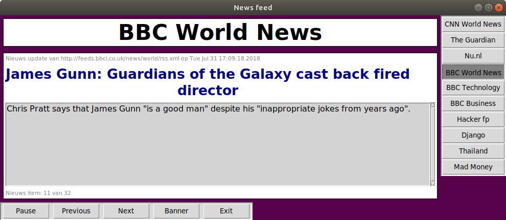

# display-news-banner
> A news banner application to show RSS news headlines.



Author: Bruno Vermeulen<br />
Email: bruno_vermeulen2001@yahoo.com<br />
Date: 21 March 2018<br />
Latest Update: 18 June 2018

## Use: 
Python 3.6

```sh
python3 news_banner_v2.py <argument>
```

argument: news_site as per dictionary below, for example 'BBC World News'

The news sites available are given in the dictionary news_list.

```sh
news_list = {'CNN World News':
             'http://rss.cnn.com/rss/edition_world.rss',
             'The Guardian':
             'https://www.theguardian.com/business/economics/rss',
             'Nu.nl':
             'http://www.nu.nl/rss/Algemeen',
             'BBC World News':
             'http://feeds.bbci.co.uk/news/world/rss.xml',
             'BBC Technology':
             'http://feeds.bbci.co.uk/news/technology/rss.xml',
             'BBC Business':
             'http://feeds.bbci.co.uk/news/business/rss.xml'}
```
Use the buttons for control: 
* pause
* next
* previous
* exit
* selection of news site

Exit by pressing Exit button, "Escape" or the root window exit (X)

This program uses the modules: tkinter, feedparser, time, re, sys
feedparser can be downloaded at: https://pypi.python.org/pypi/feedparser

This application was originally a school project by Olof Vermeulen, Groningen.
